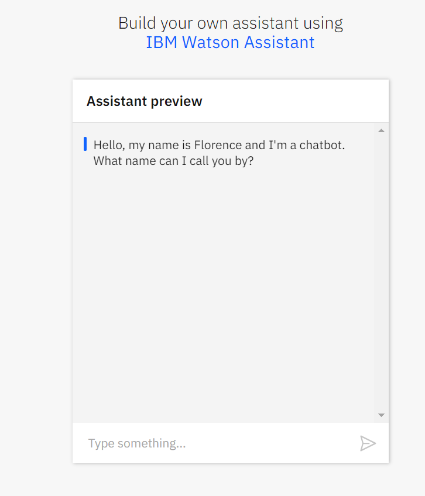
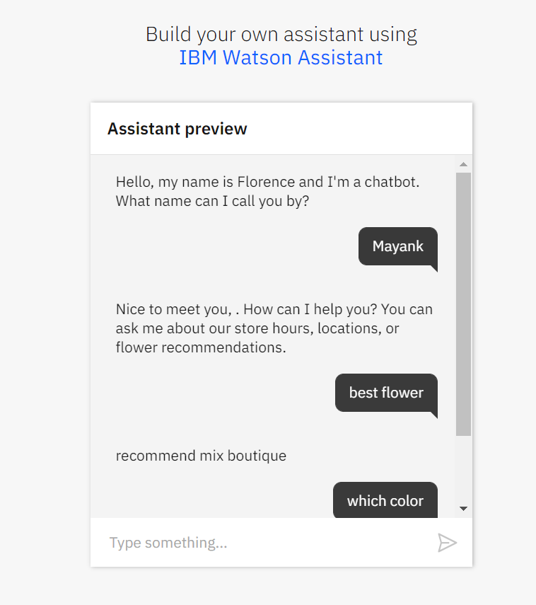

# My Chatbot by **Mayank Pathak**

This is the chatbot which myself developed while taking a course from IBM. This Chatbot have been deployed on the IBM Platform named IBM Watson.The chatbot is a flower recommendation bot like deployed on a flower selling website. It can suggest you with different kind of flowers available in the store, the opening time of the shop, 
location of the flower shop etc. Hence such kind of questions it can easily answer.

You all can check and chat with my bot on the basis of flower store and their recommendations.

The chatbot is build using the IBM Watson Assistant, you can also build your own.

You can directly check the Chatbot on your browser.

### Check chatbot in Browser
[Click here to check the chatbot in Browser](https://tinyurl.com/y7fm535n)

### Some Results of the Chatbot is displayed below 
---

---

Click or copy the link provided above to find my chatbot on the flower recommendation and buying website.
It is best recommended to chat with chatbot in the flower website store.

---

---

### Check chatbot on the website
[Click here to check the chatbot at flower website](https://mayankpathak.intelaedu.com/)

#### You can find me on LinkedIn and GitHub
### Lets Connect at : [LinkedIn](https://www.linkedin.com/in/mayank-pathak4513/) | [Github](https://github.com/mayankpathak4513)

Refer the cognitive class ai powered by IBM to find and build your own chatbot [https://cognitiveclass.ai/](https://cognitiveclass.ai/) browse above link to find the course.It doesn't require any coding part, only the mere understanding of the system and platform will help you to develop the Chatbot Easily.

#### If you have any suggestion to make then kindly reach at [mayankpathak4513@gmail.com](mayankpathak4513@gmail.com)

#### Thanks for Reading.

**Drop a Star ⭐** if you like the Repo.
